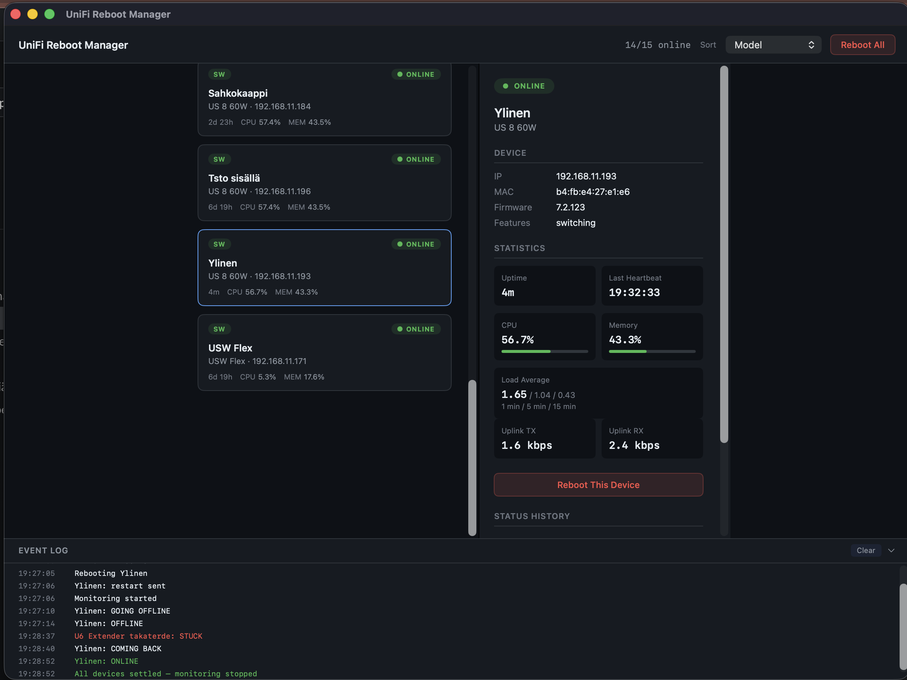

# UniFi Reboot Manager — macOS App


A native macOS application for managing and rebooting UniFi network devices. Built with SwiftUI, providing a fast, native experience with full feature parity to the web interface.



## Features

- Connect to any UniFi Controller via HTTPS
- View all network devices with real-time status (online/offline)
- Device cards showing name, model, IP address, and type (AP, Switch, Gateway)
- Detailed device information panel with uptime, firmware, and statistics
- Reboot individual devices or all devices at once
- Event log for tracking actions
- API key stored securely in macOS Keychain

## Requirements

- macOS 14.0 (Sonoma) or later
- Xcode 16.2 or later
- Swift 6

## Build

Open the project in Xcode:

```bash
open macos/UniFiRebootManager.xcodeproj
```

Or build from the command line:

```bash
xcodebuild \
  -project macos/UniFiRebootManager.xcodeproj \
  -scheme UniFiRebootManager \
  -configuration Release \
  build
```

## Setup

1. Launch the app
2. Enter your UniFi Controller details:
   - **Host URL** — Controller URL (e.g., `https://192.168.1.1`)
   - **API Key** — UniFi API key (generate in UniFi Controller settings)
   - **Site ID** — UniFi site identifier
3. Click **Connect**

The API key is stored securely in the macOS Keychain. Host and Site ID are stored in UserDefaults.

## Architecture

| File | Purpose |
|------|---------|
| `App.swift` | Application entry point |
| `ContentView.swift` | Main layout with device grid and detail panel |
| `DeviceCardView.swift` | Individual device card component |
| `DetailPanelView.swift` | Device detail sidebar |
| `SettingsView.swift` | Connection settings form |
| `EventLogView.swift` | Action event log |
| `Models.swift` | Data models for UniFi devices |
| `UniFiAPI.swift` | Network layer for UniFi Controller API |
| `DeviceManager.swift` | Device state management |
| `Theme.swift` | App-wide color and style definitions |
| `Formatters.swift` | Date and number formatting utilities |

## CI/CD

Automated builds and releases are handled by GitHub Actions:

- **Push to `main`** — Builds an unsigned DMG, uploaded as an artifact
- **Push a `v*` tag** — Builds a signed, notarized DMG and creates a GitHub Release

See [`.github/workflows/`](../.github/workflows/) for details.
